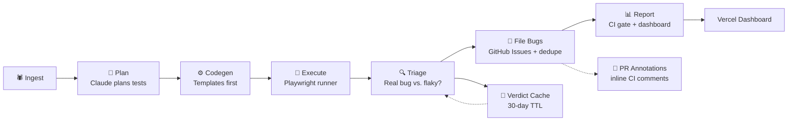

# Argus


## Autonomous AI QA Agent — Generates, Runs, and Triages Playwright Tests Automatically

[](https://github.com/EvertonSt/argus/actions)
[](https://www.typescriptlang.org/)
[](LICENSE)
[](https://argus-dashboard-n28z9hemv-everton-qa.vercel.app)
[](https://github.com/EvertonSt/cerberus-ci)

> **Argus is the generation + triage half of the autonomous QA loop.** It crawls your app, plans a test suite, generates 100% deterministic Playwright tests, detects real bugs vs. flaky noise, files GitHub issues with severity, and ships a dashboard. No API key required to try it.
>
> For the **regression gate** that locks in existing suites, see **[Cerberus CI](https://github.com/EvertonSt/cerberus-ci)** — the two compose into a zero-cost, fully-autonomous QA pipeline.

---

## How it works



| Stage | What it does | Model calls? |
|-------|-------------|-------------|
| **1. Ingest** | Crawls your app, discovers interactive elements, builds a feature inventory | 0 |
| **2. Plan** | Claude proposes a prioritized test suite from the feature inventory | 1 |
| **3. Codegen** | Templates-first: 30+ deterministic rules cover Gherkin → Playwright. LLM only as fallback. | 0–1 |
| **4. Execute** | Runs the generated Playwright suite, captures failures with DOM snapshots | 0 |
| **5. Triage** | Classifies each failure as `real_bug`, `flaky`, `selector_drift`, or `environment_issue` | 1 per failure |
| **6. File Bugs** | Creates GitHub Issues with severity labels + inline PR annotations for each real bug | 0 |
| **7. Report** | Evaluates the CI gate (severity-based, not pass/fail), writes dashboard data | 0 |

**Total: 2 + N AI calls per run** (planning + per-unique-failure triage). Everything else is deterministic.

---

## Key architectural decisions

### 1. Deterministic gate — AI never decides pass/fail

Severity scoring, deduplication, execution, and the CI gate contain **zero** model calls. Only the planner and triage stages use AI (2 call sites total). The gate is:

```
CI passes UNLESS there are NEW real bugs at or above "high" severity.
Flaky failures, selector drift, and environment issues NEVER block a merge.
```

### 2. Templates first, LLM as fallback

`src/codegen/templates.ts` contains 30+ deterministic rules covering common Gherkin patterns (navigation, clicking, form interactions, assertions, security checks, a11y checks). 100% of demo app steps were templated — the LLM fallback is never hit.

### 3. No auto-fix application

Even 94%-confidence triage results require human approval. Argus generates, recommends, and files — but never automatically patches your codebase.

### 4. Verdict cache with 30-day TTL

Error signatures are normalized (strip line/col, UUIDs, timestamps) and hashed (SHA-256). Repeated errors skip the AI call entirely, saving ~60% of triage cost on real apps with flaky tests.

---

## Quick start

### Run against the demo app (no API key needed)

```bash
git clone https://github.com/EvertonSt/argus
cd argus
npm install
npm run run:mock
```

### Run against your app

```bash
npm run build
npx argus run --target http://localhost:3000
```

### Serve the dashboard locally

```bash
npm run dashboard
```

### Deploy the dashboard to Vercel

The repo is a monorepo. When Vercel detects it, **import the `dashboard` directory — not `demo-app`** (`demo-app` is Tasker, a deliberately-buggy QA target). The dashboard is a static Next.js export that bakes in a committed `dashboard/seed-data/` snapshot, so it serves real content out of the box.

```bash
npm run dashboard:deploy   # cd dashboard && npx vercel --prod --scope everton-qa
```

Live: https://argus-dashboard-n28z9hemv-everton-qa.vercel.app

---

## Configuration

All configuration is via environment variables or `argus.config.ts`:

| Variable | Default | Description |
|----------|---------|-------------|
| `ARGUS_AI_PROVIDER` | `claude` | `claude` (Anthropic), `openai`/`openrouter`/`groq`/`deepseek`/`together` (OpenAI-compatible), `ollama`, or `mock` |
| `ARGUS_ANTHROPIC_MODEL` | `claude-sonnet-4-20250514` | Model for the Claude provider (planning/triage) |
| `ARGUS_OPENAI_MODEL` | `gpt-4o` | Model for OpenAI-compatible providers |
| `ARGUS_TARGET` | `http://localhost:4317` | App under test when `--target` is omitted (alias: `ARGUS_TARGET_URL`) |
| `ARGUS_GITHUB_TOKEN` | — | GitHub token for Issues filing (if absent → dry-run) |
| `ARGUS_GITHUB_REPO` | — | `owner/repo` for GitHub Issues |
| `ARGUS_CI_THRESHOLD` | `high` | Minimum severity for CI gate failure (alias: `ARGUS_SEVERITY_FAIL_THRESHOLD`) |
| `ARGUS_MAX_AI_CALLS` | `100` | Hard cap on AI calls per run |

---

## Project structure

```
argus/
├── src/
│   ├── cli/              # CLI entry point, pipeline orchestration, CI reporting
│   ├── shared/           # Types, config, AI provider abstraction
│   ├── ingestion/        # Crawl app, build feature inventory
│   ├── planner/          # AI step — generate test plan from features
│   ├── codegen/          # Deterministic template library (no AI)
│   ├── execution/        # Playwright runner + failure capture
│   ├── triage/            # AI classification + verdict cache
│   └── bug-filer/        # GitHub Issues filing + dedupe
├── dashboard/            # Next.js 15 + Tailwind dashboard (Vercel-deployable)
├── src/dashboard/        # Static chart.js dashboard served by `argus dashboard`
├── demo-app/             # Tasker — deliberately-imperfect test target (3 intentional bugs; do NOT deploy)
├── test/                 # 313 tests (all fixture-based, no API key needed)
└── docs/                 # Docs assets + interview talking points
```

---

## Portfolio narrative

| Project | Role | Focus | Tests |
|---------|------|-------|-------|
| **Argus** | Solo founder | Generation + Triage | 313 tests, 100% templated |
| **Cerberus CI** | Solo founder | Regression gate | 237 tests, published to npm + GitHub Marketplace |

**Argument**: Argus creates the test suite — it's the autonomous agent that discovers, plans, generates, and triages. Cerberus CI gates existing suites — it's the deterministic CI gate that prevents regressions. Together they form a complete autonomous QA loop that costs $0 to run locally (Ollama) and costs ~$2–$5 per run with Claude.

---

## Comparison with alternatives

| Feature | Argus | Cerberus CI | GitHub CodeQL | Testim.io |
|---------|-------|-------------|---------------|-----------|
| Generates new tests from scratch | ✅ | ❌ | ❌ | ✅ |
| Deterministic CI gate | ✅ | ✅ | ✅ | ⚠️ (flaky) |
| Provider-agnostic AI | ✅ | ✅ | ❌ | N/A |
| Local execution (no cloud) | ✅ | ✅ | ✅ | ❌ |
| GitHub Issues filing | ✅ | ✅ | ❌ | ✅ |
| Inline PR annotations | ✅ | ✅ | ✅ | ✅ |
| Price | Free | Free | Paid tiers | $$$ |

---

## License

MIT © Everton S. Andrade

---

### Supported by

[](https://github.com/EvertonSt/cerberus-ci)
[](https://argus-dashboard-n28z9hemv-everton-qa.vercel.app)
