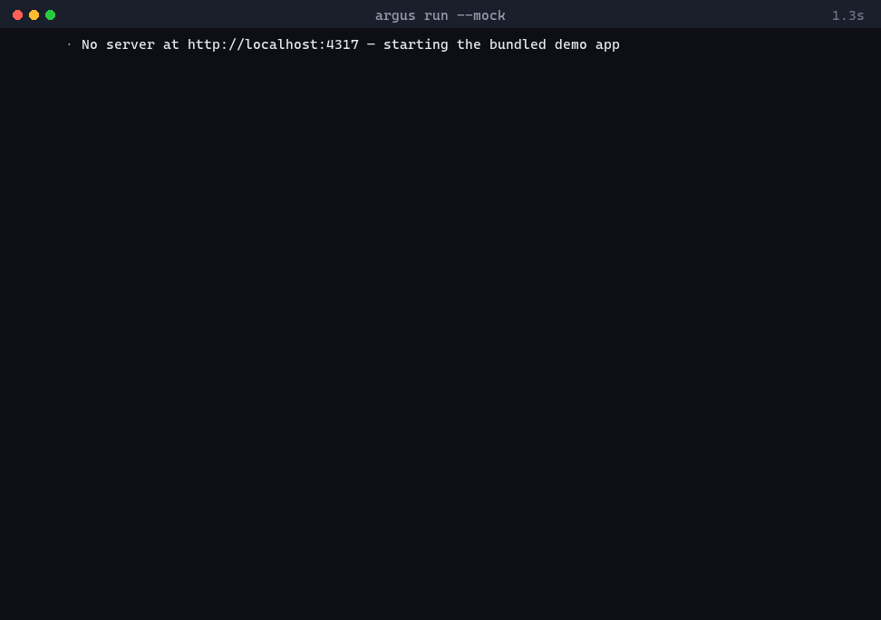

# Argus

**An autonomous AI QA agent.** Point it at a web app. It explores the app, asks Claude to plan a test suite, compiles that plan into real Playwright tests, runs them, and then — the part that matters — asks Claude *why* each test failed, so it can tell a genuine product bug apart from a flaky test or a selector that went stale. Real bugs get filed automatically, with severity and duplicate detection. Everything else gets reported without blocking your merge.

```
npx tsx src/cli/index.ts run --mock
```

<!-- Replace with a recording of the command above. asciinema or a terminal GIF both work.
     docs/demo.gif is referenced here so the image slot is ready. -->


---

## Why this exists

Most "AI writes your tests" demos stop at generation. Generation is the easy half. The hard half is the morning after: your suite is red, and somebody has to work out whether the app broke, the test is flaky, or a designer renamed a button.

Argus closes that loop. An LLM plans the tests, a deterministic engine runs them, and the LLM triages its own failures. Only failures it classifies as real bugs get filed — and only those can block a merge.

That last distinction is the whole design. A QA gate that cries wolf gets switched off within a month.

---

## Architecture

```mermaid
flowchart LR
    subgraph det1[" "]
        A[Ingestion<br/><i>Playwright crawl<br/>+ markdown specs</i>]
    end
    subgraph ai1[" "]
        B[Planner<br/><i>Claude</i>]
    end
    subgraph det2[" "]
        C[Codegen<br/><i>templates first,<br/>LLM fallback</i>]
        D[Execution<br/><i>Playwright runner</i>]
    end
    subgraph ai2[" "]
        E[Triage<br/><i>Claude</i>]
    end
    subgraph det3[" "]
        F[Bug filer<br/><i>severity + dedupe</i>]
        G[Dashboard<br/>+ CI gate]
    end

    A -->|FeatureInventory| B
    B -->|TestCase&#91;&#93;| C
    C -->|*.spec.ts| D
    D -->|RunSummary| E
    E -->|TriageResult&#91;&#93;| F
    F -->|FiledBug&#91;&#93;| G
    E -.->|flaky / selector_drift<br/>reported, never filed| G

    classDef ai fill:#5b8cff22,stroke:#5b8cff,stroke-width:2px,color:#e8ebf2
    classDef det fill:#3ddc9722,stroke:#3ddc97,stroke-width:2px,color:#e8ebf2
    class B,E ai
    class A,C,D,F,G det
```



**Blue stages reason with an LLM. Green stages are deterministic.** That boundary is enforced, not aspirational: severity scoring, duplicate matching, test execution, and the CI gate contain no model calls, which is why they can be unit-tested to a fixed answer. The two AI stages are tested against saved fixtures, so `npm test` needs no API key and costs nothing.

---

## Quick start — no API key needed

Requires Node 20+.

```bash
git clone https://github.com/EvertonSt/argus.git
cd argus
npm install
npx playwright install chromium

npm run run:mock        # full pipeline, bundled fixtures, zero cost
npm run dashboard       # then open the URL it prints
```

`run:mock` starts the bundled demo app for you, runs the whole loop against it, and finishes in well under a minute. It exercises every stage — the only difference from a live run is that Claude's two responses come from `fixtures/` instead of the API.

Expected output:

```
[1/7] Ingest    ✓ 10 features discovered
[2/7] Plan      ✓ 8 test cases planned — 2 critical, 2 high, 3 medium, 1 low
[3/7] Codegen   ✓ 8 spec files, 26 steps — 100% deterministic
[4/7] Execute   ✓ 4 passed, 4 failed
[5/7] Triage    ✓ 3 real bug(s), 1 flaky, 0 selector drift
[6/7] File bugs ✓ 3 bug(s) filed — 3 new, 0 duplicate(s)
[7/7] Report    ✓ CI gate FAIL
```

Four tests fail against the demo app. Three are real seeded bugs; one is test-ordering noise. Argus files the three and ignores the fourth.

---

## Running it for real

```bash
cp .env.example .env      # then add your key
npm run argus -- run --target http://localhost:4317
```

| Variable | Default | Purpose |
| --- | --- | --- |
| `ANTHROPIC_API_KEY` | — | Required unless `--mock` |
| `ANTHROPIC_MODEL` | `claude-sonnet-4-20250514` | Swap models without touching code |
| `ARGUS_TARGET_URL` | `http://localhost:4317` | Default app under test |
| `ARGUS_SEVERITY_FAIL_THRESHOLD` | `high` | Minimum severity that fails CI |
| `ARGUS_MAX_AI_CALLS` | `25` | Hard cap; the run prints its budget before spending |

Without a key and without `--mock`, Argus tells you exactly that — no stack trace:

```
✗ ANTHROPIC_API_KEY is not set, and --mock was not passed.
  Run `argus run --mock` to try Argus with bundled fixtures (no key, no cost),
  or copy .env.example to .env and add your key.
```

### Commands

| Command | What it does |
| --- | --- |
| `argus run --target <url>` | Full pipeline against a live app |
| `argus run --specs <dir>` | Plan from markdown user stories instead of a crawl |
| `argus run --mock` | Full pipeline on fixtures — no key, no cost |
| `argus dashboard` | Serve the dashboard, print the URL |
| `argus triage-log` | Last run's triage reasoning, in the terminal |
| `argus ci-comment` | Render the run as a markdown PR comment |

---

## The demo app

`demo-app/` is a small task tracker (list, add, complete, delete) that ships with three deliberately seeded defects. Without them, a demo just prints "5/5 passed" and proves nothing.

Argus catches all three:

| Seeded defect | Verdict | Severity |
| --- | --- | --- |
| Delete removes the wrong task when two share the same text | `real_bug` (94%) | critical |
| "Mark complete" doesn't survive a page refresh | `real_bug` (91%) | high |
| The add form accepts an empty string | `real_bug` (88%) | high |

It also correctly *declines* to file a fourth failure caused by test ordering, classifying it `flaky` at 62% confidence.

### Demonstrating selector drift

The interesting case is a failure that is **not** a bug:

```bash
npm run run:mock      # generates tests against a button labelled "Add task"
npm run demo:drift    # relabels it "Create task", re-runs the SAME suite
```

The add-task test now fails. The feature works perfectly — only the label moved. Argus classifies it:

```
· selector_drift (86%) — Adding a task appends it to the task list
  The click timed out because getByRole('button', { name: 'Add task' }) matched
  nothing, while the rest of the page rendered and the add-task form is still
  present. The button was relabelled 'Create task' — the feature works, the
  test's locator is stale.
  suggested fix: Replace page.getByRole('button', { name: 'Add task' }) with
  page.getByTestId('add-task'), which survives label changes.

✓ 1 failure(s) classified as selector_drift — reported for review, not filed as bugs.
  Argus never applies these automatically — a human approves every change.
```

Self-healing suggestions are surfaced for review and **never auto-applied**. A test suite that silently rewrites its own assertions to match whatever the app currently does is not a test suite.

---

## Design decisions worth arguing about

**Templates first, LLM second.** Codegen maps Gherkin clauses to Playwright calls through a deterministic template library and only falls back to Claude for clauses nothing matches. Against the demo app, 100% of 26 steps compile from templates — zero LLM calls in codegen. Pure LLM-generated test code is flaky and undebuggable; this is faster, cheaper, and reproducible.

**The CI gate is severity-based, not pass/fail.** Flaky and selector-drift failures are reported and never block. Only a *new* real bug at or above `ARGUS_SEVERITY_FAIL_THRESHOLD` fails the build. This targets the specific reason teams abandon automated QA gates: unrelated PRs blocked by noise.

**Ported, not rewritten.** Severity scoring and duplicate detection come from my [Bug Report Generator](https://github.com/EvertonSt); planning prompts from my [AI Test Case Generator](https://github.com/EvertonSt). Their tuned heuristics carried over intact — the only change is that input now arrives from triage instead of a CLI prompt.

**Everything is inspectable JSON.** `data/` holds the feature inventory, planned cases, run history, triage log, and filed bugs as pretty-printed JSON. No database. For a portfolio project, being able to open the artifacts matters more than scale.

**A bug title carries no boilerplate.** An early version appended "— fails against the application" to every title; the shared suffix pushed unrelated bugs past the similarity threshold and two real defects were silently swallowed as duplicates. There's now a regression test pinning it.

---

## Testing

```bash
npm test        # 241 tests, no API key required, no network calls
npm run typecheck
```

Deterministic modules are unit-tested directly. The two AI modules are tested against saved fixture responses, including the malformed-response paths — schema validation, retry-once, and loud failure.

| Module | Tests | Notes |
| --- | ---: | --- |
| Ingestion | 22 | Parsing against a recorded DOM fixture |
| Planner | 32 | Schema validation, retry, prompt construction |
| Codegen | 50 | Every template rule, LLM fallback, sanitisation |
| Execution | 18 | Report parsing against a real recorded run |
| Triage | 30 | All four verdicts, malformed responses |
| Bug filer | 42 | Severity, dedupe, environment, regressions |
| Dashboard | 17 | Zero-build guarantees, graceful degradation |
| CI report | 30 | Comment rendering, gate rules, workflow wiring |

---

## CI

`.github/workflows/argus.yml` runs the full loop on every PR and posts a summary comment — pass/fail counts, triage breakdown, newly filed bugs, and any self-heal suggestions. It updates its existing comment instead of stacking a new one per push, and falls back to `--mock` when no API key is available so forks and Dependabot PRs still get a working run.

The build fails only when the severity gate trips.

---

## Project layout

```
argus/
  demo-app/          Task tracker with three seeded bugs + KNOWN_BUGS.md
  src/
    ingestion/       Crawl + spec parsing → FeatureInventory
    planner/         Claude → TestCase[] (validated)
    codegen/         TestCase[] → Playwright .spec.ts
    execution/       Runs the suite, parses structured results
    triage/          Claude → TriageResult[] (why it failed)
    bug-filer/       Severity, dedupe, environment → FiledBug[]
    dashboard/       Zero-build static site (HTML/CSS/JS + Chart.js)
    cli/             Orchestrator, CI report, drift demo
    shared/          Types, config, logger, Anthropic client
  fixtures/          Saved AI responses — the tests never call the API
  data/              Generated at runtime (gitignored)
  generated-tests/   Written by codegen, then executed (gitignored)
```

---

## Not in v1

Deliberately scoped out: multi-page autonomous crawling, visual regression diffing, auto-applying selector fixes, real GitHub Issues, chat notifications, and a hosted multi-tenant version.

## License

MIT
