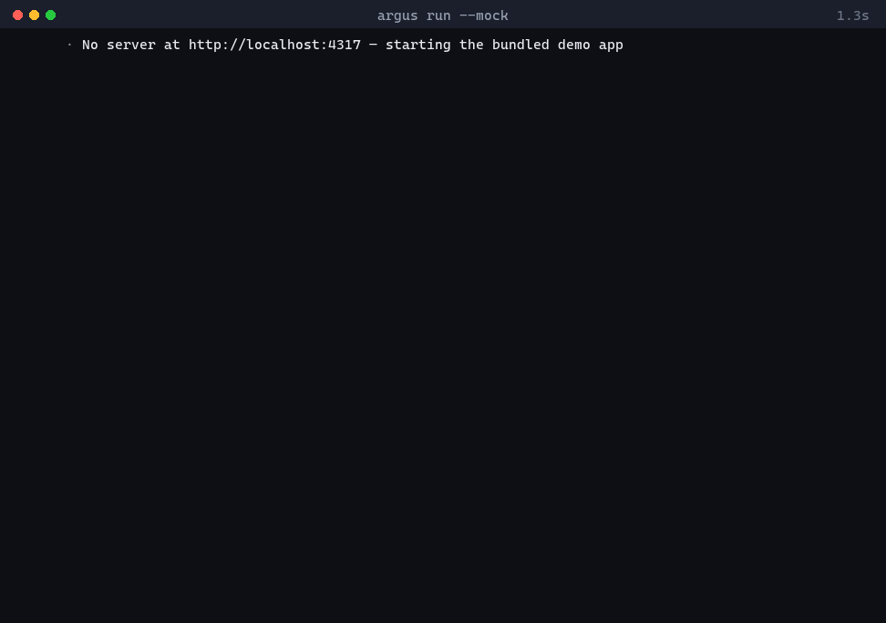
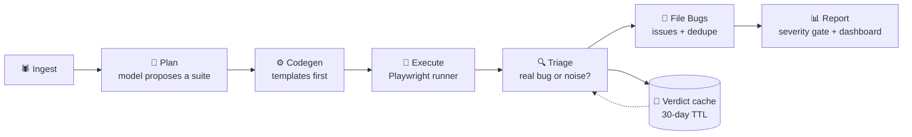

# Argus



## An autonomous QA agent that plans tests, runs them, and triages its own failures

[](https://github.com/EvertonSt/argus/actions)
[](https://www.typescriptlang.org/)
[](LICENSE)

> Argus is the **generation and triage** half of an autonomous QA loop: it
> crawls an app, plans a test suite, generates Playwright specs, runs them,
> decides which failures are real bugs, and files the real ones as GitHub
> issues with a severity.
>
> No API key to try it — `--mock` runs the whole loop against bundled fixtures.
>
> For the other half — a deterministic gate over tests you already have — see
> [Cerberus CI](https://github.com/EvertonSt/cerberus-ci). The two compose.

---

## The problem

A QA agent that reports every failure is worse than no QA agent. A suite with a
3% flake rate produces a red build roughly every other run, and the first
reasonable response is to stop reading it. That is how a regression gate gets
ignored, and the usual reason nobody trusts one is that flaky tests blocked an
unrelated PR six times last week.

Argus is built around the opposite idea: **the model decides what a failure
means, and nothing but arithmetic decides whether a merge is blocked.**

```
The gate is:

  CI passes UNLESS there are NEW real bugs at or above "high" severity.
  Flaky failures, selector drift, and environment issues NEVER block a merge.
```

"New" is measured, not assumed. Defects that were already in the repository are
recorded in [`baseline/known-bugs.json`](baseline/known-bugs.json) — the three
the demo app ships deliberately are in there — and a failure matching one is
reported as known instead of blocking. A gate that can never be green is a gate
people learn to ignore; see [ADR 0007](docs/decisions/0007-baseline-known-defects-in-source.md)
for how the match is defined and why it is keyed on feature id rather than on
the volatile text of a Playwright error.

Severity scoring, deduplication, execution and the gate contain **zero** model
calls. Only planning and triage use a model — two call sites. The cost of a run
is bounded before it starts (`ARGUS_MAX_AI_CALLS`), not discovered afterwards.

---

## How it works


```mermaid
flowchart LR
    A[🕷️ Ingest] --> B[🤖 Plan<br/>model proposes a suite]
    B --> C[⚙️ Codegen<br/>templates first]
    C --> D[🧪 Execute<br/>Playwright runner]
    D --> E[🔍 Triage<br/>real bug or noise?]
    E --> F[🐛 File Bugs<br/>issues + dedupe]
    F --> G[📊 Report<br/>severity gate + dashboard]
    E --> H[(💾 Verdict cache<br/>30-day TTL)]
    H -.-> E
```

| Stage            | What it does                                                                                  | Model calls          |
| ---------------- | --------------------------------------------------------------------------------------------- | -------------------- |
| **1. Ingest**    | Crawls the app, discovers interactive elements, builds a feature inventory                    | 0                    |
| **2. Plan**      | Model proposes a prioritised suite from the inventory                                         | 1                    |
| **3. Codegen**   | Templates first — 30+ deterministic rules cover common Gherkin shapes. Model only as fallback | 0–1                  |
| **4. Execute**   | Runs the generated suite, captures failures with DOM snapshots                                | 0                    |
| **5. Triage**    | Classifies each failure as `real_bug`, `flaky`, `selector_drift` or `environment_issue`       | 1 per unique failure |
| **6. File Bugs** | Opens issues with severity labels and inline PR annotations                                   | 0                    |
| **7. Report**    | Evaluates the severity gate, writes dashboard data                                            | 0                    |

**Total: 2 + N model calls per run.** Everything else is arithmetic.

---

## Decisions worth explaining in an interview

### The model never decides pass/fail

Only two stages call a model. The gate is `SEVERITY_RANK[severity] >=
SEVERITY_RANK[threshold]` — a lookup. That is testable without a key, and it is
why the CI job can run `--mock` and still produce a meaningful gate.

### Templates first, model as fallback

`src/codegen/templates.ts` maps 30+ common Gherkin patterns to Playwright
deterministically. The model is only asked when no template matches, so the
generated spec is reproducible for the common cases and the model is spending
its budget on the ambiguous ones.

### It recommends, it never patches

Even a 94%-confidence triage verdict stops at "here is the fix". Applying it
automatically would mean a QA tool editing source on a schedule, and the first
time it is confidently wrong it will be reverted by a human who has lost trust
in the tool.

### Error signatures, not raw messages

Line and column numbers, UUIDs and timestamps are stripped before hashing
(SHA-256). The same logical failure therefore hits the cache whether or not it
moved by a line, and a repeated failure skips the model call entirely.

---

## Try it in a minute

```bash
git clone https://github.com/EvertonSt/argus.git
cd argus
pnpm install
pnpm run run:mock        # full loop against the bundled demo app, no key
```

Against your own app:

```bash
pnpm build
node dist/cli/index.js run --target http://localhost:3000
```

File real bugs (needs a token; without one it dry-runs and prints what it
would have filed):

```bash
export ARGUS_GITHUB_TOKEN=...
export ARGUS_GITHUB_REPO=owner/repo
pnpm argus -- run
```

---

## What is actually tested

| Layer            | What it covers                                                           | Count   |
| ---------------- | ------------------------------------------------------------------------ | ------- |
| Planner / triage | Prompt construction, response validation, retry and fallback             | 4 files |
| Codegen          | Template selection, fallback, and the security/a11y rules                | 2 files |
| Bug filer        | Severity, environment fingerprinting, duplicate suppression              | 3 files |
| Storage & config | JSON helpers, run ids, slugging, env-driven config                       | 4 files |
| AI providers     | Call cap, retry classification, auth handling — with a stubbed transport | 3 files |
| Pipeline         | Runnability preconditions and the severity threshold                     | 1 file  |
| CI & demo app    | Workflow wiring, demo-app lifecycle, logger behaviour                    | 3 files |

**388 tests across 20 files. No test makes a network call or needs an API key**,
so a fresh clone is green offline.

### What these checks do not prove

Stated plainly, because a suite that claims too much is worse than a smaller one
that claims exactly what it does:

- **The browser-driven path is not unit tested.** `runPipeline`, `src/execution`
  and the injected browser script are exercised by running the real loop against
  the demo app — see [`.github/workflows/argus.yml`](.github/workflows/argus.yml)
  — not by this suite. That is why the coverage floor is 75 and not 80: the
  missing lines are the ones that decide whether a merge is blocked, and
  excluding them to make a headline number look better would be exactly the
  wrong trade.
- **Coverage is 77% statements / 87% branches over `src/` only.** It says
  nothing about the dashboard, which has no unit tests at all.
- **No test has called a live Anthropic endpoint.** Both providers are tested
  against a stubbed transport. A real endpoint may reject the request shape, and
  nothing here would find out.
- **The planner and triage verdicts have only ever been seen against fixtures
  and the demo app.** Whether triage correctly separates a real regression from
  a flake _on your codebase_ is the open question, and it is the reason the
  gate is severity-based rather than pass/fail.
- **The baseline treats two defects on the same feature as one.** Matching is on
  `(featureId, verdict)`, so a second, different bug in an already-broken feature
  is reported as known rather than new. That is a deliberate trade: erring
  toward "known" keeps the gate usable, and the cost is a missed regression that
  a reviewer has to catch. It is the sharpest edge in this design.

---

## Honest status

|                         |                                                                                                                                                 |
| ----------------------- | ----------------------------------------------------------------------------------------------------------------------------------------------- |
| **Works**               | Crawl → plan → codegen → execute → triage → file → report, in mock and live modes; severity gate; PR comments; local dashboard; the QA workflow |
| **Needs a key**         | Live planning and triage. `--mock` covers the whole loop without one                                                                            |
| **Dry-run by default**  | Issue filing writes what it _would_ file unless `ARGUS_GITHUB_TOKEN` and `ARGUS_GITHUB_REPO` are set                                            |
| **Not deployed**        | Deploy-ready for the dashboard; nothing is deployed. `dashboard/` is a static export, so it needs no runtime                                    |
| **Deliberately absent** | No auto-patching. No hosted service. No multi-repo aggregation                                                                                  |

---

## Configuration

Everything is environment variables. There is no config file to learn.

| Variable                | Default                    | Meaning                                                                                              |
| ----------------------- | -------------------------- | ---------------------------------------------------------------------------------------------------- |
| `ARGUS_AI_PROVIDER`     | `claude`                   | `claude`, `openai-compatible` (`openai`/`openrouter`/`groq`/`deepseek`/`together`), `ollama`, `mock` |
| `ARGUS_ANTHROPIC_MODEL` | `claude-sonnet-4-20250514` | Model for planning and triage                                                                        |
| `ARGUS_OPENAI_MODEL`    | provider default           | Model for OpenAI-compatible providers                                                                |
| `ARGUS_TARGET`          | `http://localhost:4317`    | App under test (aliases: `ARGUS_TARGET_URL`, `TARGET_URL`)                                           |
| `ARGUS_GITHUB_TOKEN`    | —                          | Token for issue filing. Absent ⇒ dry run                                                             |
| `ARGUS_GITHUB_REPO`     | —                          | `owner/repo` for issue filing                                                                        |
| `ARGUS_CI_THRESHOLD`    | `high`                     | Minimum severity that fails CI (alias: `ARGUS_SEVERITY_FAIL_THRESHOLD`)                              |
| `ARGUS_MAX_AI_CALLS`    | `100`                      | Hard cap per run. The call is refused, not queued                                                    |
| `ARGUS_BROWSER`         | `chromium`                 | Browser channel for the execution stage                                                              |

`.env.example` lists the names. The gate scans committed files for anything
key-shaped, so an accidental `.env` fails CI rather than shipping.

---

## Layout

```
argus/
├── src/
│   ├── cli/          # commander wiring, pipeline orchestration, PR comment
│   ├── shared/       # types, env config, provider abstraction, storage
│   ├── ingestion/    # crawl the app, build a feature inventory
│   ├── planner/      # model call 1: the test plan
│   ├── codegen/      # deterministic template library (no model)
│   ├── execution/    # Playwright runner and failure capture
│   ├── triage/       # model call 2: classification, plus the verdict cache
│   ├── bug-filer/    # issues, severity, duplicate suppression
│   └── dashboard/    # static chart.js dashboard served by `argus dashboard`
├── dashboard/        # Next.js 15 + Tailwind dashboard (separate workspace package)
├── demo-app/         # Tasker — a deliberately broken test target. Do not deploy
├── baseline/         # committed known defects — what the gate treats as already there
├── test/             # 388 tests, no network, no key
├── fixtures/         # model responses and reports the suite runs against
└── docs/             # talking points and the demo capture
```

The engine never imports React and the dashboard never imports the engine.
`dashboard/` is a workspace package rather than a nested npm project so there is
one lockfile and one audit rather than two that can disagree.

---

## Running the gates

```bash
pnpm gate            # everything this repository checks about itself
pnpm gate:fast       # skip the two builds
```

Eleven steps: format, lint, typecheck (both projects), unit tests, three
repository gates, the coverage floor, the CLI build, the dashboard build, and a
step that **fails if the builds modified a tracked file** — because a tool that
silently rewrites a source file leaves you with a red gate and a clean tree.

---

## Licence

MIT © Everton S. Andrade
